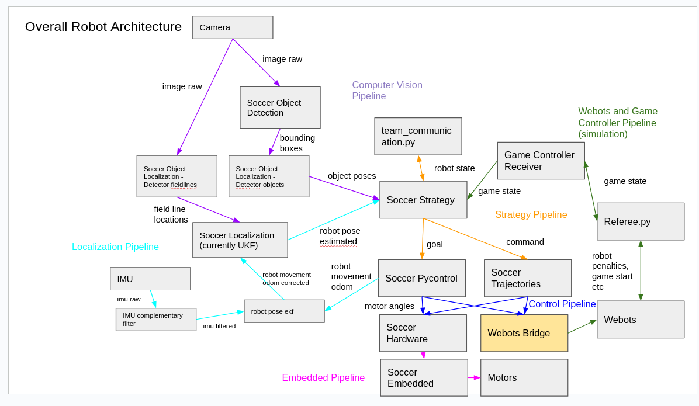

# Robotic Code OP3



How to run 

build
```bash
❯ colcon build --continue-on-error
```


action editor
```bash
ros2 run op3_action_editor webots_executor.py
```


rqt_image_view 
```bash
ros2 run rqt_image_view rqt_image_view
```

### TODO

[ ] Docker
[ ] Lokalisasi
   OTW UKF https://chatgpt.com/share/69209904-ab40-8010-be8c-09a715ca9bb4
